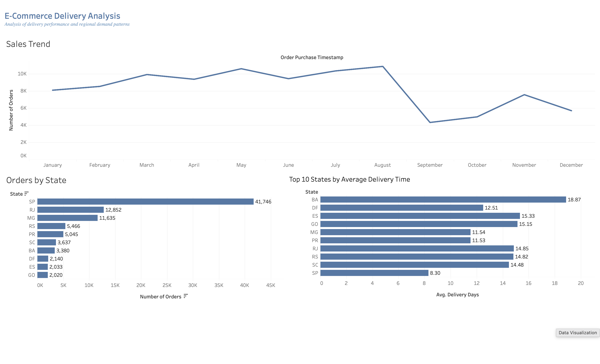

# 📦 E-Commerce Delivery & Sales Analysis

## 📌 Project Overview

This project analyzes a Brazilian e-commerce dataset to explore sales trends, regional demand distribution, and delivery performance.

The objective is to identify logistical inefficiencies and uncover data-driven opportunities to improve delivery efficiency and customer experience.

---

## 📊 Dataset

Brazilian E-commerce Public Dataset (Olist)

---

## 🛠 Tools Used

* Python (pandas) — data cleaning and feature engineering
* Google Colab — analysis environment
* Tableau Public — interactive dashboard visualization

---

## 📊 Dashboard

View Interactive Dashboard on Tableau: [https://public.tableau.com/...](https://public.tableau.com/views/E-CommerceDeliveryAnalysis/Dashboard2?:language=en-US&publish=yes&:sid=&:redirect=auth&:display_count=n&:origin=viz_share_link)

---

## 🔍 Key Analysis

### 📈 Sales Trend

* Orders steadily increased throughout 2017
* Peak demand observed in late 2017 – early 2018
* Decline at the end of the timeline is due to incomplete data

---

### 🌍 Regional Demand

* São Paulo (SP) dominates in order volume (~40K+ orders)
* Other high-demand states include RJ and MG
* Demand is highly concentrated in a few regions

---

### 🚚 Delivery Performance

* Average delivery time: ~12 days
* Median delivery time: 10 days
* Significant variability across regions
* Extreme outliers observed (up to 200+ days)

---

## ⚠️ Key Insights

### 1. Demand Concentration

Order volume is highly concentrated in a few states, with **São Paulo (SP)** dominating significantly.

### 2. Demand vs Delivery Efficiency

High-demand regions (SP, RJ, MG) show faster delivery times, suggesting more efficient logistics and better infrastructure.

### 3. Regional Inequality in Delivery

Remote states (RR, AP, AM) experience **significantly longer delivery times**, highlighting geographic and logistical constraints.

### 4. Business Opportunity

Improving delivery infrastructure in low-demand regions could:

* reduce delivery delays
* increase customer satisfaction
* expand market reach

## 📌 Business Impact

* Identified regions with inefficient delivery performance
* Revealed strong demand concentration in key states
* Highlighted opportunities for logistics optimization and expansion

---

## 📌 Conclusion

Delivery performance varies significantly across regions.
While high-demand states benefit from efficient logistics, remote areas face delays.
Targeted improvements in these regions could provide measurable business value.

---
